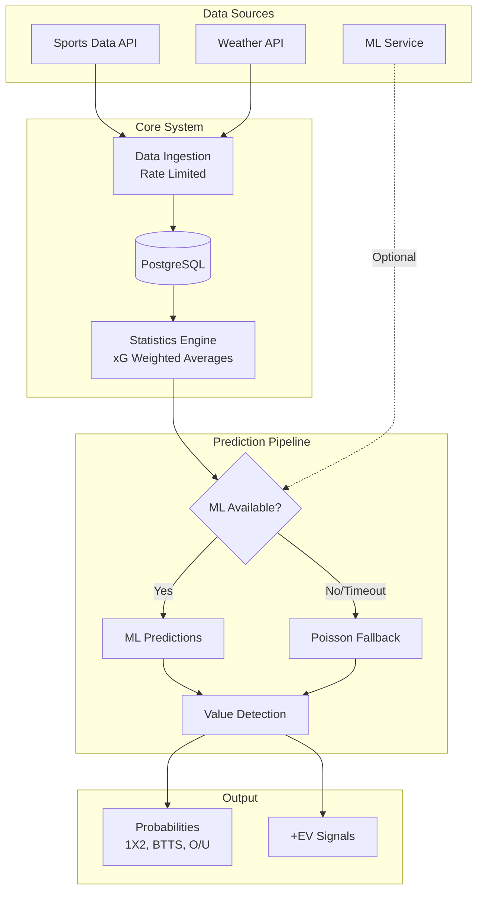
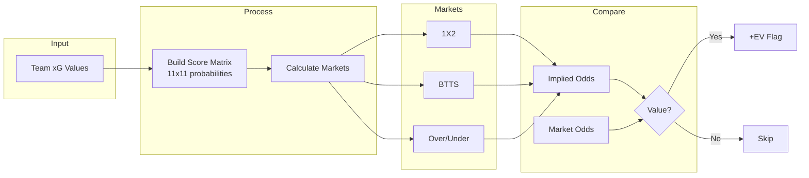
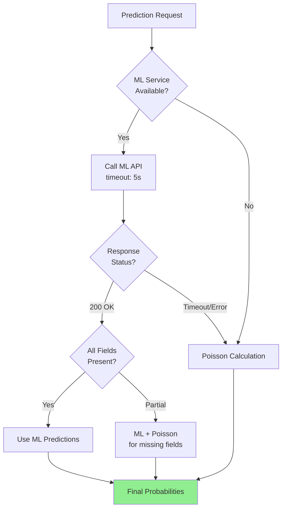

# Football Probability Prediction System

**[Versión en Español](es/README.md)** | English

A case study documenting the architecture and implementation of a sports probability prediction engine that combines ML predictions with traditional Poisson-based statistical methods.

---

## System Overview

---

## Key Features

- **Hybrid ML + Statistical Architecture** — ML predictions first, Poisson fallback automatically
- **Partial Response Tolerance** — Handles incomplete ML responses gracefully
- **Contract Testing** — Validates mathematical invariants (probability ranges, sum consistency)
- **Value Detection** — Compares calculated probabilities against market odds

---

## Prediction Flow

---

## ML Fallback Strategy

---

## Documentation

| Document | Description | Audience |
|----------|-------------|----------|
| [Main Case Study](football-prediction-case-study.md) | Complete portfolio case study | General |
| [Executive Summary](case-study-executive-summary.md) | High-level overview | Recruiters / Managers |
| [Technical Appendix](case-study-technical-appendix.md) | Detailed technical docs | Tech Leads / Engineers |
| [Pipeline Explained](probability-pipeline-explained.md) | Prediction pipeline | Data Scientists / ML Engineers |
| [Mathematical Formulas](probability-pipeline-formulas.md) | Poisson derivations | Statisticians / Quants |

## Technical Diagrams

More detailed Mermaid diagrams. **[Browse all →](visualizations/README.md)**

---

## Tech Stack

| Component | Technology |
|-----------|------------|
| Backend | Ruby on Rails |
| Database | PostgreSQL |
| HTTP Client | Faraday (retry/backoff) |
| Testing | RSpec |
| Optimization | L-BFGS-B |

---

## Related Projects

| Project | Description |
|---------|-------------|
| [football-expected-goals-ml-pipeline](https://github.com/oscgonz19/football-expected-goals-ml-pipeline) | The ML prediction service that integrates with this system |

---

*No credentials, internal URLs, or proprietary implementation details included.*
