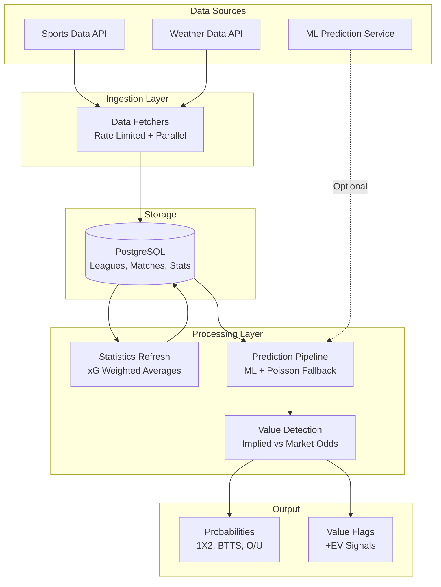

# Football Probability Prediction System

> Case Study - Executive Summary

---

  

<em>Sample prediction output: 1X2 probabilities, expected goals (xG), BTTS, and Over/Under markets.</em>

---

## Context

Sports odds encode implied probabilities, but they also include bookmaker margin and market inefficiencies. This project builds an independent probability engine that estimates pre-match probabilities and compares them against market odds to flag potential positive expected value (+EV) signals.

The system runs as a daily pipeline across multiple football leagues, producing probabilities for three core markets: match result (1X2), both teams to score (BTTS), and total goals (Over/Under). It combines historical performance, expected goals (xG), weather conditions, and optional predictions from an external ML service—without making the ML dependency a single point of failure.

  

<em>Goals follow a Poisson distribution: home teams average 1.70 goals vs 1.34 for away teams.</em>

---

## My Role

I designed and implemented the integration between the baseline statistical engine (Poisson-based) and an external ML prediction service, enabling a hybrid architecture that remains operational under service outages, timeouts, and partial responses.

**Key contributions:**

- **Hybrid ML + Fallback Architecture**: Implemented graceful degradation: attempt ML predictions first and automatically fall back to Poisson calculations when the ML service fails, times out, or returns incomplete payloads.

- **ML Service Client**: Built an HTTP client with structured payloads, granular error handling (timeouts/validation/5xx), retries with exponential backoff, and contextual logging for production debugging.

- **Legacy Consolidation**: Led a refactor consolidating probability calculations into a single processing path, reducing legacy coupling while preserving backward compatibility via deprecation warnings.

- **Partial Response Tolerance**: Added validation that accepts partial ML responses, logs warnings, and completes missing values via statistical fallback—allowing independent API evolution.

- **Contract & Regression Testing**: Built a test suite validating invariants (0-1 ranges, probability mass consistency, reasonable xG), covering both ML-success and fallback scenarios.

- **Production Hardening**: Reconciled parsing and validation with real service behavior observed in staging/production, improving diagnostics and reducing integration breakage.

---

## Architecture (High Level)

---

## Prediction Pipeline

The system transforms raw match data into market probabilities through these stages:

1. **Data Ingestion**: Fetch matches, team statistics, and odds from the sports data provider. Designed around API rate limits and partial/late data availability.

2. **Weather Integration**: Retrieve forecast or historical weather data for each stadium. Matches with extreme conditions (high wind, heavy rain, extreme temperatures) are flagged as high-risk.

3. **Statistics Refresh**: Calculate weighted xG averages across the last three seasons (65% current, 25% previous, 10% two-prior), adjusting for season completion percentage.

4. **Pre-Match xG Assignment**: Assign expected goals to each team based on their offensive/defensive performance, adjusted by league context (home/away differentials).

5. **Probability Calculation**: Request predictions from the ML service when available; otherwise calculate using Poisson distribution with finishing efficiency offsets. The system falls back automatically if ML is unavailable or returns partial data.

  

<em>Poisson probability matrix: each cell shows the probability of that exact scoreline.</em>

6. **Value Detection**: Compare calculated probabilities against market odds. When implied odds are lower than market odds, flag the opportunity as +EV.

7. **Persistence**: Store all probabilities, adjusted metrics, and value flags for downstream consumption.

---

## Team Analysis

  

<em>Teams positioned by attack vs defense strength. Bottom-right quadrant = strongest teams.</em>

---

## Results

  

<em>Model calibration: predictions align with actual outcomes (diagonal = perfect calibration).</em>

The system runs daily to process matchdays across multiple leagues, with:

- **No hard dependency on the ML service**; predictions continue via fallback when the external service is unavailable or degraded

- **Low-latency Poisson path** enables batch processing of full matchdays without blocking on external calls

- **Test suite includes unit + integration/contract tests**, validating both ML-success and fallback scenarios against defined invariants

- **Supports independent evolution of the ML service contract** through partial response tolerance and defensive validation

---

## Lessons Learned

**Graceful degradation over hard dependencies**: Building the fallback mechanism from day one meant the system never blocked on ML service issues. The traditional Poisson calculations provide a solid baseline while ML predictions add incremental value when available.

**Contract testing catches what mocks miss**: The regression test suite caught several contract mismatches between expected and actual API responses that unit tests with mocks would have missed. Testing against the real service (in staging) proved essential.

**Partial response tolerance enables iteration**: By accepting incomplete ML responses and filling gaps with traditional calculations, we could deploy integration changes incrementally without requiring perfect API alignment upfront.

**Logging context matters in production**: Adding match IDs, prediction sources, and error types to every log message made debugging integration issues significantly faster when problems occurred.

**Deprecation warnings preserve velocity**: Instead of breaking changes, using deprecation warnings allowed other parts of the system to migrate at their own pace while new functionality was immediately available.

---

*Document prepared for public portfolio. Contains no credentials, internal URLs, or proprietary implementation details.*
