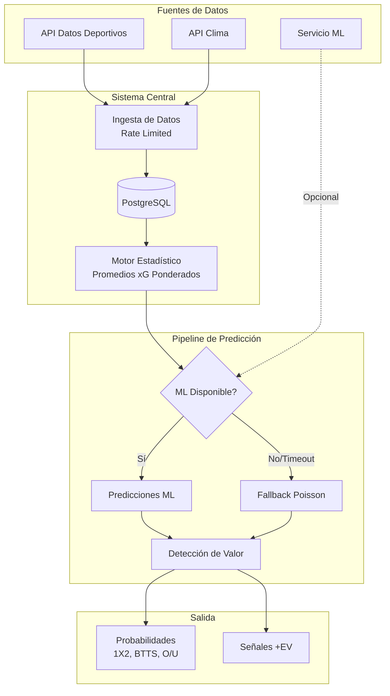
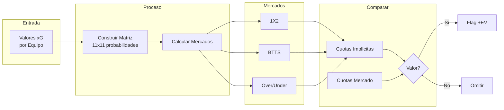
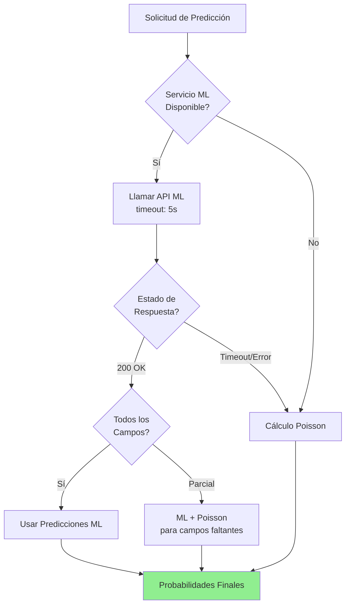

# Sistema de Predicción de Probabilidades de Fútbol

**[English Version](../README.md)** | Español

Un caso de estudio documentando la arquitectura e implementación de un motor de predicción de probabilidades deportivas que combina predicciones ML con métodos estadísticos basados en Poisson.

---

## Vista General del Sistema

---

## Características Principales

- **Arquitectura Híbrida ML + Estadística** — Predicciones ML primero, fallback Poisson automático
- **Tolerancia a Respuestas Parciales** — Maneja respuestas ML incompletas gracefully
- **Testing de Contrato** — Valida invariantes matemáticos (rangos, consistencia)
- **Detección de Valor** — Compara probabilidades calculadas contra cuotas del mercado

---

## Flujo de Predicción

---

## Estrategia de Fallback ML

---

## Documentación

| Documento | Descripción | Audiencia |
|-----------|-------------|-----------|
| [Caso de Estudio Principal](football-prediction-case-study.md) | Caso de estudio completo | General |
| [Resumen Ejecutivo](case-study-executive-summary.md) | Visión general | Recruiters / Managers |
| [Anexo Técnico](case-study-technical-appendix.md) | Documentación técnica | Tech Leads / Ingenieros |
| [Pipeline Explicado](probability-pipeline-explained.md) | Pipeline de predicción | Data Scientists / ML Engineers |
| [Fórmulas Matemáticas](probability-pipeline-formulas.md) | Derivaciones Poisson | Estadísticos / Quants |

## Diagramas Técnicos

Más diagramas Mermaid detallados. **[Ver todos →](../visualizations/README.md)** *(en inglés)*

---

## Stack Tecnológico

| Componente | Tecnología |
|------------|------------|
| Backend | Ruby on Rails |
| Base de Datos | PostgreSQL |
| Cliente HTTP | Faraday (retry/backoff) |
| Testing | RSpec |
| Optimización | L-BFGS-B |

---

## Proyectos Relacionados

| Proyecto | Descripción |
|----------|-------------|
| [football-expected-goals-ml-pipeline](https://github.com/oscgonz19/football-expected-goals-ml-pipeline) | El servicio de predicción ML que se integra con este sistema |

---

*Sin credenciales, URLs internas, ni detalles de implementación propietarios.*
