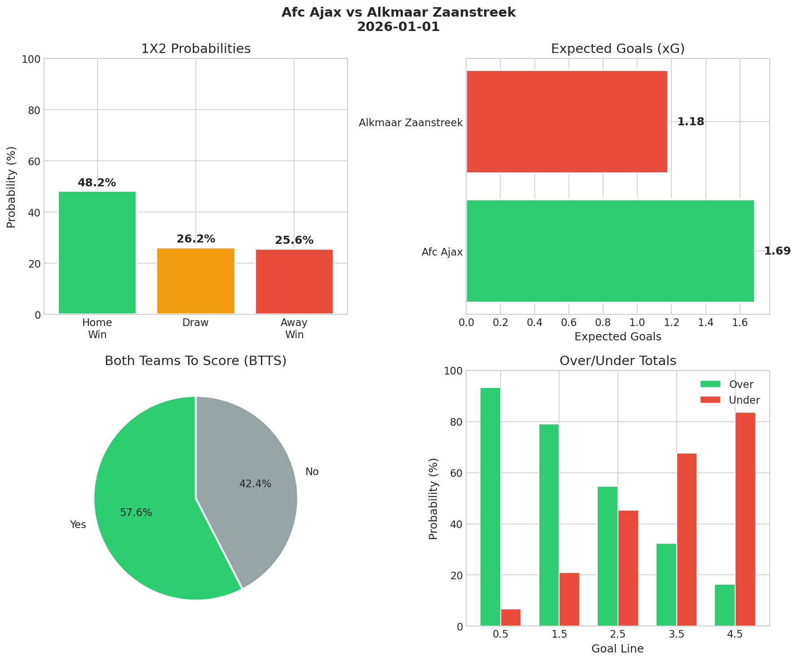
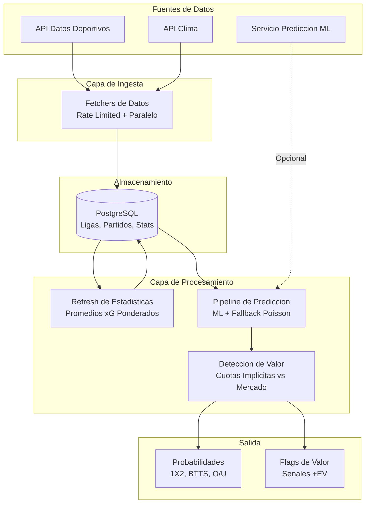
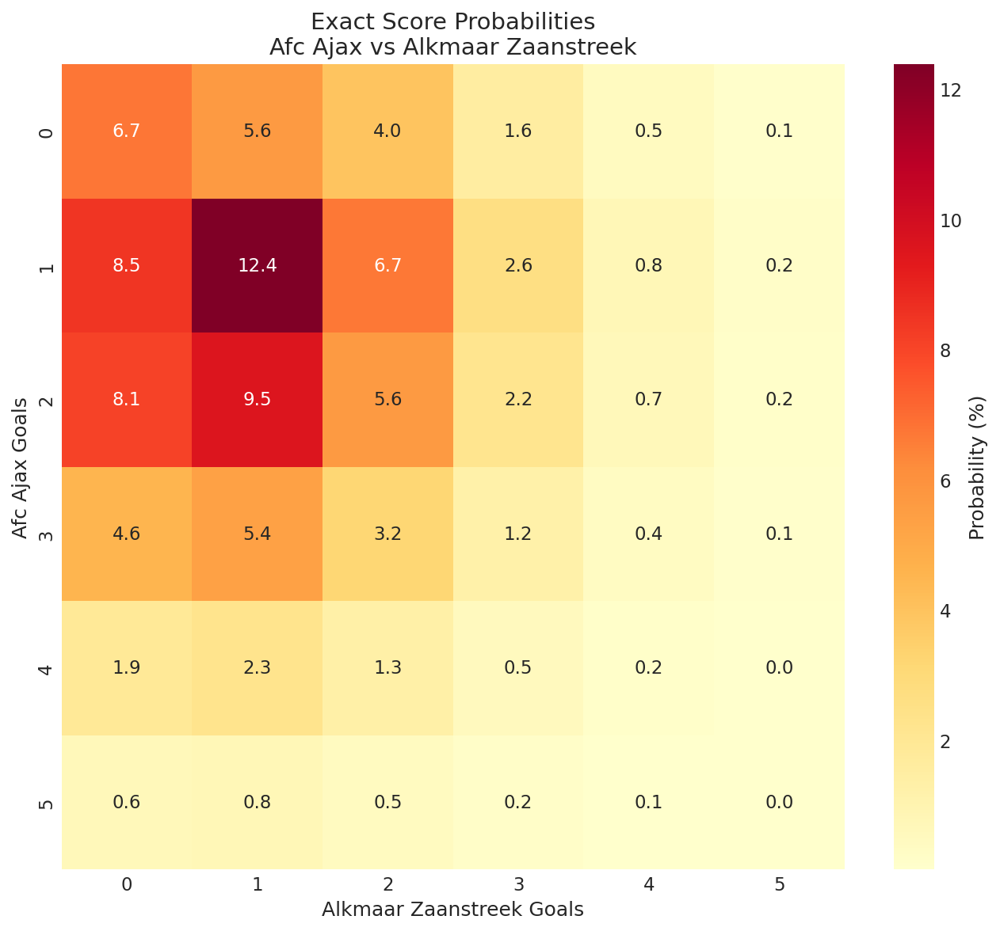
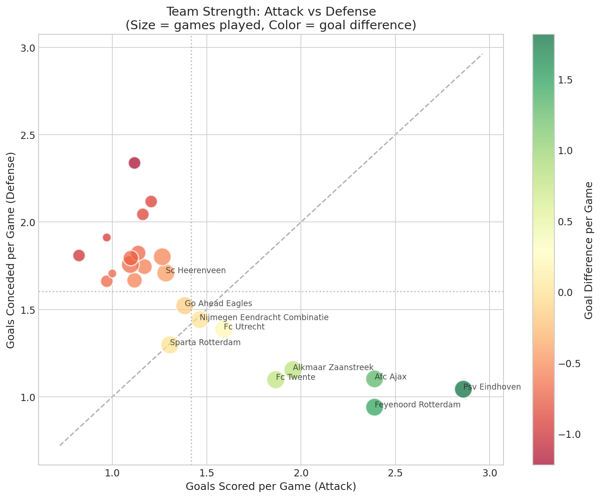
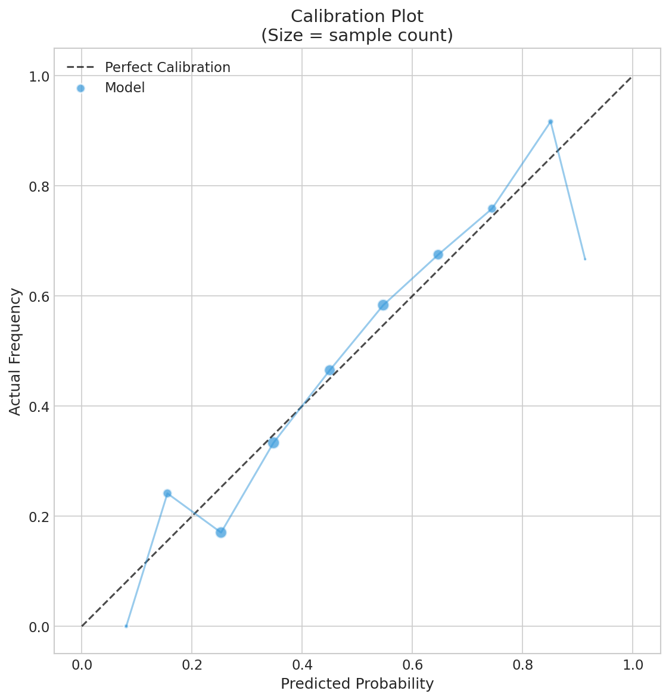

# Sistema de Prediccion de Probabilidades de Futbol

> Caso de Estudio - Resumen Ejecutivo

---

  

<em>Ejemplo de salida: probabilidades 1X2, goles esperados (xG), BTTS y mercados Over/Under.</em>

---

## Contexto

Las cuotas deportivas codifican probabilidades implicitas, pero tambien incluyen el margen del bookmaker e ineficiencias del mercado. Este proyecto construye un motor de probabilidades independiente que estima probabilidades pre-partido y las compara contra cuotas del mercado para marcar senales potenciales de valor esperado positivo (+EV).

El sistema opera como un pipeline diario a traves de multiples ligas de futbol, produciendo probabilidades para tres mercados principales: resultado del partido (1X2), ambos equipos anotan (BTTS), y total de goles (Over/Under). Combina rendimiento historico, goles esperados (xG), condiciones climaticas, y predicciones opcionales de un servicio ML externo—sin hacer de la dependencia ML un punto unico de falla.

  

<em>Goles siguen distribucion Poisson: locales promedian 1.70 goles vs 1.34 visitantes.</em>

---

## Mi Rol

Disene e implemente la integracion entre el motor estadistico base (basado en Poisson) y un servicio externo de prediccion ML, habilitando una arquitectura hibrida que permanece operativa ante caidas de servicio, timeouts y respuestas parciales.

**Contribuciones clave:**

- **Arquitectura Hibrida ML + Fallback**: Implemente degradacion graceful: intenta predicciones ML primero y automaticamente recurre a calculos Poisson cuando el servicio ML falla, tiene timeout, o retorna payloads incompletos.

- **Cliente del Servicio ML**: Construi un cliente HTTP con payloads estructurados, manejo granular de errores (timeouts/validacion/5xx), reintentos con backoff exponencial, y logging contextual para debugging en produccion.

- **Consolidacion Legacy**: Lidere un refactor consolidando calculos de probabilidades en un unico path de procesamiento, reduciendo acoplamiento legacy mientras preservaba compatibilidad hacia atras via warnings de deprecacion.

- **Tolerancia a Respuestas Parciales**: Agregue validacion que acepta respuestas ML parciales, registra warnings, y completa valores faltantes via fallback estadistico—permitiendo evolucion independiente de la API.

- **Testing de Contrato y Regresion**: Construi una suite de tests validando invariantes (rangos 0-1, consistencia de masa de probabilidad, xG razonable), cubriendo tanto escenarios de exito ML como fallback.

- **Hardening para Produccion**: Reconcilie parsing y validacion con comportamiento real del servicio observado en staging/produccion, mejorando diagnosticos y reduciendo roturas de integracion.

---

## Arquitectura (Alto Nivel)

---

## Pipeline de Prediccion

El sistema transforma datos crudos de partidos en probabilidades de mercado a traves de estas etapas:

1. **Ingesta de Datos**: Obtiene partidos, estadisticas de equipos y cuotas del proveedor de datos deportivos. Disenado considerando limites de tasa de API y disponibilidad parcial/tardia de datos.

2. **Integracion de Clima**: Recupera datos de pronostico o clima historico para cada estadio. Partidos con condiciones extremas (viento fuerte, lluvia intensa, temperaturas extremas) se marcan como alto riesgo.

3. **Refresh de Estadisticas**: Calcula promedios xG ponderados de las ultimas tres temporadas (65% actual, 25% anterior, 10% dos anteriores), ajustando por porcentaje de completitud de temporada.

4. **Asignacion de xG Pre-Partido**: Asigna goles esperados a cada equipo basado en su rendimiento ofensivo/defensivo, ajustado por contexto de liga (diferenciales local/visitante).

5. **Calculo de Probabilidades**: Solicita predicciones al servicio ML cuando esta disponible; de lo contrario calcula usando distribucion Poisson con offsets de eficiencia de finalizacion. El sistema recurre automaticamente a fallback si ML no esta disponible o retorna datos parciales.

  

<em>Matriz de probabilidades Poisson: cada celda muestra la probabilidad de ese marcador exacto.</em>

6. **Deteccion de Valor**: Compara probabilidades calculadas contra cuotas del mercado. Cuando cuotas implicitas son menores que cuotas del mercado, marca la oportunidad como +EV.

7. **Persistencia**: Almacena todas las probabilidades, metricas ajustadas y flags de valor para consumo posterior.

---

## Analisis de Equipos

  

<em>Equipos posicionados por fortaleza de ataque vs defensa. Cuadrante inferior derecho = equipos mas fuertes.</em>

---

## Resultados

  

<em>Calibracion del modelo: predicciones alineadas con resultados reales (diagonal = calibracion perfecta).</em>

El sistema corre diariamente para procesar jornadas a traves de multiples ligas, con:

- **Sin dependencia dura del servicio ML**; las predicciones continuan via fallback cuando el servicio externo no esta disponible o degradado

- **Path Poisson de baja latencia** habilita procesamiento batch de jornadas completas sin bloquear en llamadas externas

- **Suite de tests incluye tests unitarios + integracion/contrato**, validando tanto escenarios de exito ML como fallback contra invariantes definidos

- **Soporta evolucion independiente del contrato del servicio ML** a traves de tolerancia a respuestas parciales y validacion defensiva

---

## Lecciones Aprendidas

**Degradacion graceful sobre dependencias duras**: Construir el mecanismo de fallback desde el dia uno significo que el sistema nunca se bloqueo por problemas del servicio ML. Los calculos Poisson tradicionales proveen una baseline solida mientras las predicciones ML agregan valor incremental cuando estan disponibles.

**Tests de contrato capturan lo que los mocks pierden**: La suite de tests de regresion capturo varias discrepancias de contrato entre respuestas esperadas y reales de la API que tests unitarios con mocks habrian perdido. Testear contra el servicio real (en staging) resulto esencial.

**Tolerancia parcial habilita iteracion**: Al aceptar respuestas ML incompletas y llenar gaps con calculos tradicionales, pudimos deployar cambios de integracion incrementalmente sin requerir alineacion perfecta de API por adelantado.

**Logging contextual importa en produccion**: Agregar IDs de partido, fuentes de prediccion, y tipos de error a cada mensaje de log hizo debugging de problemas de integracion significativamente mas rapido cuando ocurrieron problemas.

**Warnings de deprecacion preservan velocidad**: En lugar de cambios breaking, usar warnings de deprecacion permitio que otras partes del sistema migraran a su propio ritmo mientras nueva funcionalidad estaba inmediatamente disponible.

---

*Documento preparado para portafolio publico. No contiene credenciales, URLs internas, ni detalles de implementacion propietarios.*
