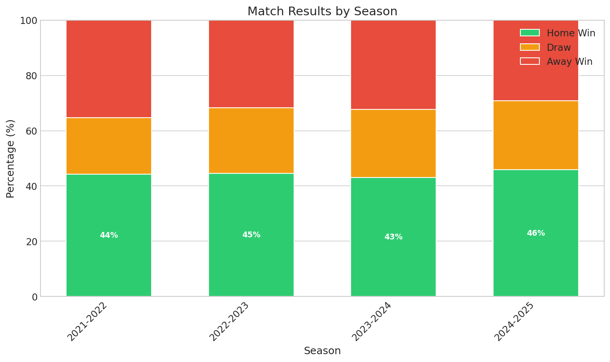

# Football Probability Prediction System

> Portfolio Case Study

---

<p align="center">
  
</p>

<p align="center"><em>Complete prediction output showing 1X2 probabilities, expected goals, and market opportunities.</em></p>

---

## What is This System

This is a sports probability prediction engine that calculates pre-match probabilities for football matches and compares them against market odds to identify positive expected value (+EV) opportunities. The system runs as a daily automated pipeline across multiple leagues, combining historical team performance, expected goals (xG) metrics, weather data, and optional machine learning predictions. It produces probabilities for three core markets—match result (1X2), both teams to score (BTTS), and total goals (Over/Under)—while maintaining operational continuity through a hybrid architecture that doesn't depend on any single external service.

### The Data Foundation

<p align="center">
  
</p>

<p align="center"><em>Historical goals distribution: home teams average 1.70 goals vs 1.34 for away teams. These Poisson-like distributions form the mathematical basis of our prediction model.</em></p>

---

## My Role

I designed and implemented the integration layer between the baseline statistical engine and an external ML prediction service, creating a hybrid system that remains operational under service failures, timeouts, and incomplete responses.

- **Hybrid Architecture Design**: Built a prediction pipeline that attempts ML predictions first and automatically falls back to Poisson-based calculations when the external service is unavailable, times out, or returns partial data—ensuring predictions always complete.

- **ML Service Client**: Developed the HTTP client with structured request payloads, granular error handling (timeouts, validation errors, server failures), retry logic with exponential backoff, and contextual logging for production debugging.

- **Partial Response Tolerance**: Implemented validation logic that accepts incomplete ML responses, logs warnings without failing, and fills missing market probabilities via statistical fallback—allowing the ML service contract to evolve independently.

- **Legacy Consolidation**: Led a refactor that unified probability calculations into a single processing path, reducing architectural complexity while preserving backward compatibility through deprecation warnings.

- **Contract & Regression Testing**: Created a test suite validating mathematical invariants (probability ranges, sum consistency, reasonable xG bounds) across both ML-success and fallback scenarios, including end-to-end tests against the live ML service.

- **Production Hardening**: Reconciled parsing logic with real service behavior observed in staging, fixing response structure mismatches and improving error diagnostics.

---

## Architecture

```
┌─────────────────────────────────────────────────────────────────┐
│                        DATA SOURCES                             │
│  ┌─────────────┐  ┌─────────────┐  ┌─────────────────────────┐  │
│  │ Sports Data │  │ Weather API │  │ ML Prediction Service   │  │
│  │     API     │  │             │  │      (optional)         │  │
│  └──────┬──────┘  └──────┬──────┘  └───────────┬─────────────┘  │
└─────────┼────────────────┼─────────────────────┼────────────────┘
          │                │                     │
          ▼                ▼                     │
┌─────────────────────────────────────┐          │
│         INGESTION LAYER             │          │
│   Rate-limited, parallel fetchers   │          │
└─────────────────┬───────────────────┘          │
                  │                              │
                  ▼                              │
┌─────────────────────────────────────┐          │
│      STORAGE (PostgreSQL)           │          │
│  Leagues, Seasons, Matches, Stats   │          │
└─────────────────┬───────────────────┘          │
                  │                              │
                  ▼                              │
┌─────────────────────────────────────┐          │
│      STATISTICS PROCESSING          │          │
│  Weighted xG averages (3 seasons)   │          │
│  Finishing efficiency calibration   │          │
└─────────────────┬───────────────────┘          │
                  │                              │
                  ▼                              ▼
┌─────────────────────────────────────────────────────────────────┐
│                    PREDICTION PIPELINE                          │
│  ┌───────────┐   ┌───────────┐   ┌───────────┐   ┌───────────┐  │
│  │  Climate  │ → │    xG     │ → │ ML / Stat │ → │   Value   │  │
│  │  Filter   │   │ Assignment│   │  Hybrid   │   │ Detection │  │
│  └───────────┘   └───────────┘   └───────────┘   └───────────┘  │
└─────────────────────────────────────────────────────────────────┘
                              │
                              ▼
┌─────────────────────────────────────────────────────────────────┐
│                          OUTPUT                                 │
│    Probabilities (1X2, BTTS, O/U)  +  Value Flags (+EV)         │
└─────────────────────────────────────────────────────────────────┘
```

The system ingests data from a sports statistics provider and a weather API, stores normalized records in PostgreSQL, processes multi-season statistics with temporal weighting, and runs predictions through a hybrid pipeline. The ML service is called when available but is never a hard dependency—the statistical fallback ensures every match gets processed.

### Team Strength Analysis

<p align="center">
  
</p>

<p align="center"><em>Teams positioned by attack (goals scored) vs defense (goals conceded). Size = sample size, color = goal difference.</em></p>

---

## How It Works

The pipeline transforms raw match data into market probabilities through seven stages:

1. **Data Ingestion**: Fetch matches, team statistics, and odds from the sports data provider. Designed around API rate limits and handles partial or delayed data gracefully.

2. **Weather Integration**: Retrieve forecast or historical weather for each stadium. Matches with extreme conditions (high wind, heavy precipitation, temperature extremes) are flagged as high-risk for downstream filtering.

3. **Statistics Refresh**: Calculate weighted xG averages across the last three seasons using a 65/25/10 weighting scheme, dynamically adjusted by current season completion percentage.

4. **Pre-Match xG Assignment**: Assign expected goals to each team based on their offensive/defensive performance, normalized by league context (home/away differentials).

5. **Probability Calculation**: Request predictions from the ML service if available. On timeout, error, or partial response, automatically fall back to Poisson distribution calculations with finishing efficiency adjustments.

<p align="center">
  
</p>

<p align="center"><em>Poisson-based probability matrix: each cell shows the probability of that exact scoreline.</em></p>

6. **Value Detection**: Compare calculated probabilities against market odds. When implied odds (1/probability) are lower than market odds, flag the opportunity as positive expected value.

7. **Persistence**: Store all probabilities, adjusted metrics, and value flags for analysis and downstream consumption.

---

## Technical Details That Matter

### Fallback Strategy

The prediction pipeline implements graceful degradation across three tiers:

| Tier | Condition | Action |
|------|-----------|--------|
| 1 | ML returns complete response | Use ML predictions |
| 2 | ML returns partial response | Use ML for available markets, fill gaps with Poisson |
| 3 | ML fails, times out, or unavailable | Use Poisson for all markets |

Fallback is automatic and requires no operator intervention. The system logs which path was taken for every match, enabling monitoring of ML service health.

### Partial Response Tolerance

The validation layer accepts incomplete ML responses by design. If the ML service returns 1X2 probabilities but omits BTTS, the system:
- Accepts the 1X2 values
- Logs a warning (not an error)
- Calculates BTTS using the statistical method
- Continues processing

This allows the ML service to evolve its contract independently—new markets can be added or removed without breaking the consumer.

### Validation Invariants

All probability outputs are validated before persistence:

```
Range:     0.0 ≤ P ≤ 1.0 for all probabilities
Sum:       |P(home) + P(draw) + P(away) - 1.0| < 0.05
           |P(btts_yes) + P(btts_no) - 1.0| < 0.05
           |P(over) + P(under) - 1.0| < 0.05
Sanity:    0.0 ≤ xG < 10.0 (no team expects 10+ goals)
```

Matches failing validation are logged and excluded from value detection.

### Contract Testing

The test strategy follows a pyramid:

- **Unit tests**: Pure logic with mocked dependencies (run in CI)
- **Integration tests**: HTTP stubbing with realistic fixtures (run in CI)
- **Regression tests**: Real calls to live ML service, validating the actual contract (run on-demand, gated by environment flag)

Regression tests catch contract drift that mocked tests would miss—response structure changes, new fields, removed markets.

---

## Historical Validation

<p align="center">
  
</p>

<p align="center"><em>Four seasons of data show consistent patterns: ~44-46% home wins, ~21-25% draws, ~29-35% away wins. This stability validates our modeling assumptions.</em></p>

---

## Results

<p align="center">
  
</p>

<p align="center"><em>Calibration plot: when we predict 60%, events occur ~60% of the time. Diagonal = perfect calibration.</em></p>

The system runs daily across multiple leagues, processing full matchdays through the hybrid pipeline.

**What we validated:**

- No hard dependency on the ML service—predictions complete via fallback when the external service is degraded or unavailable
- Low-latency statistical path enables batch processing without blocking on external calls
- Invariant validation catches malformed data before it affects downstream analysis
- Regression tests against the live ML service confirmed contract alignment after staging iterations
- Fallback rate monitoring provides visibility into ML service reliability

**What we didn't measure (yet):**

- Prediction accuracy vs. market closing lines
- Long-term ROI on flagged +EV opportunities
- Comparison of ML vs. statistical prediction quality

These require longitudinal data collection and are planned for future evaluation.

---

## Lessons Learned

**Build fallback from day one.** The hybrid architecture wasn't an afterthought—it was a design requirement. This meant the system was never blocked by ML service issues during development or staging.

**Contract tests catch what mocks miss.** Unit tests with stubs verified logic, but regression tests against the real ML service caught structure mismatches that would have caused production failures.

**Partial tolerance enables independent evolution.** By accepting incomplete responses instead of failing hard, the ML team could iterate on their API without coordinating deployments.

**Contextual logging pays off.** Adding match IDs, prediction source (ML vs. statistical), and error types to every log message made debugging integration issues significantly faster.

**Deprecation warnings preserve team velocity.** Instead of breaking changes to legacy code paths, warnings let other parts of the system migrate at their own pace.

---

## Next Steps

- **Prediction accuracy tracking**: Collect closing lines and actual results to measure calibration
- **A/B comparison**: Quantify ML vs. statistical prediction quality once sufficient data exists
- **Additional markets**: Extend pipeline to support correct score, Asian handicap
- **Real-time odds ingestion**: Move from daily batch to continuous odds monitoring
- **Alerting on fallback rate**: Trigger alerts when ML fallback exceeds threshold

---

*Case study prepared for public portfolio. Contains no credentials, internal identifiers, or proprietary implementation details.*
