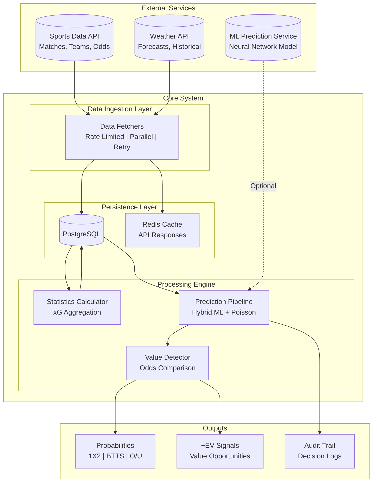
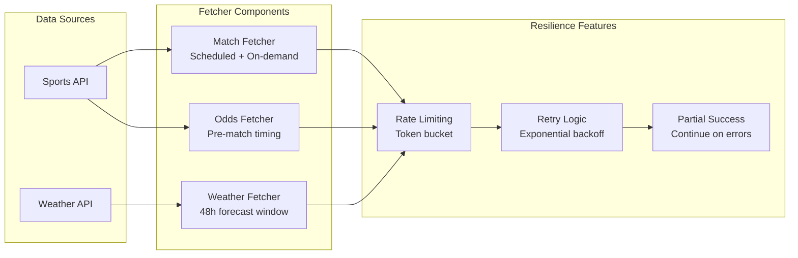
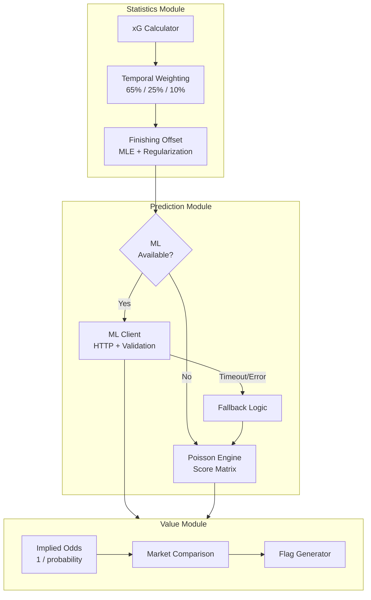
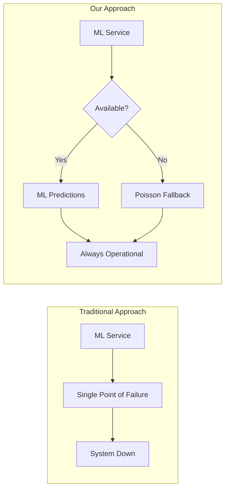

# System Architecture

> High-level view of the Football Probability Prediction System

---

## Component Overview

---

## Layer Responsibilities

### Data Ingestion Layer

---

### Processing Engine

---

## Data Flow Summary

| Stage | Input | Output | Key Logic |
|-------|-------|--------|-----------|
| **Ingestion** | API responses | Raw match data | Rate limiting, retry, partial success |
| **Storage** | Raw data | Normalized tables | Leagues, teams, matches, stats |
| **Statistics** | Historical matches | Weighted xG | 3-season weighted average |
| **Prediction** | Team xG values | Probabilities | Hybrid ML + Poisson |
| **Value Detection** | Probabilities + Odds | +EV flags | Implied vs market comparison |

---

## Key Design Decisions

### Why Hybrid Architecture?

### Why Poisson as Fallback?

| Aspect | ML Model | Poisson |
|--------|----------|---------|
| Accuracy | Higher (when trained) | Industry baseline |
| Latency | ~500ms | <10ms |
| Reliability | Service-dependent | Always available |
| Interpretability | Black box | Transparent |
| Data needs | Large training set | Small sample OK |

---

*This architecture ensures the system produces predictions continuously, regardless of external service availability.*

---

[Back to Visualizations Index](./README.md)
