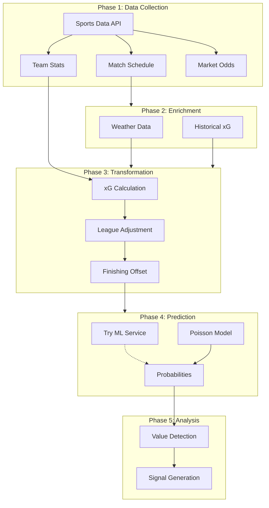
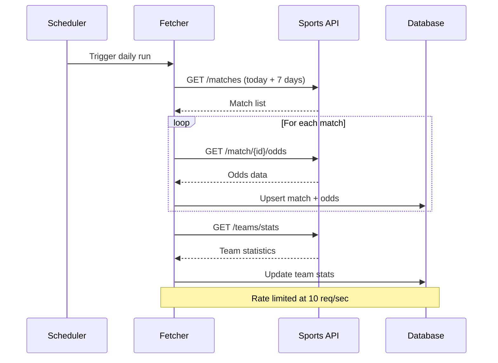
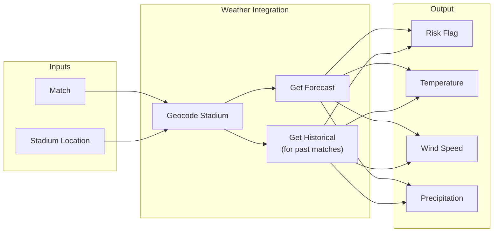
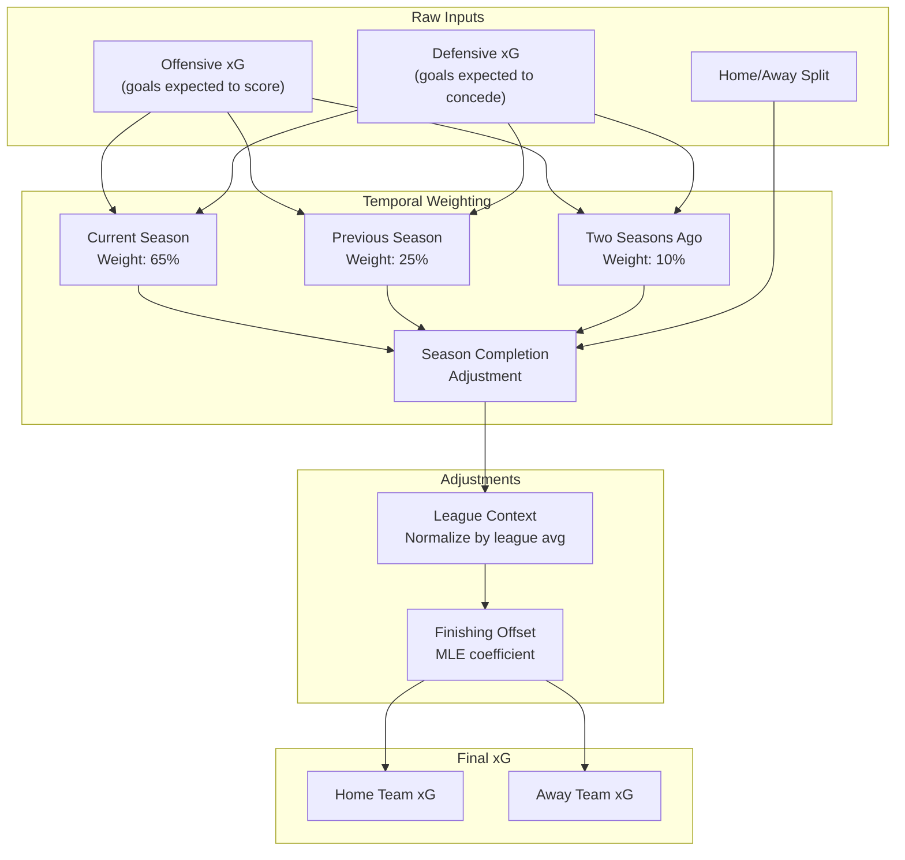
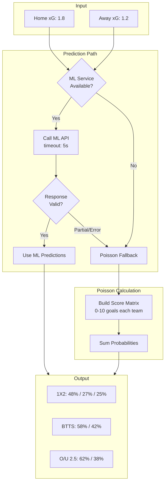
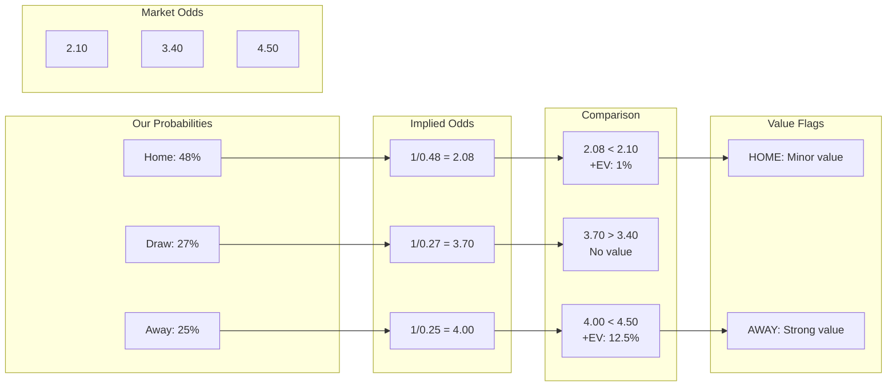

# Data Flow Pipeline

> Complete journey of data from raw API responses to actionable predictions

---

## Historical Data Overview

  

*Four seasons of data showing consistent patterns: ~44-46% home wins, ~21-25% draws, ~29-35% away wins.*

---

## End-to-End Flow

---

## Phase Details

### Phase 1: Data Collection

**Key Points:**
- Scheduled daily before first matches
- Fetches 7-day window for advance processing
- Rate limited to respect API constraints
- Partial failures don't block entire run

---

### Phase 2: Enrichment

**Weather Thresholds:**
| Condition | Threshold | Effect |
|-----------|-----------|--------|
| Wind | > 50 km/h | High risk flag |
| Rain | > 10 mm/h | High risk flag |
| Temperature | < -5C or > 35C | High risk flag |

---

### Phase 3: Transformation

---

### Phase 4: Prediction

---

### Phase 5: Analysis

---

## Data State at Each Phase

| Phase | Data Format | Volume | Latency |
|-------|-------------|--------|---------|
| Collection | JSON from API | ~100 matches/day | ~5 min |
| Enrichment | Joined records | Same | ~2 min |
| Transformation | Calculated xG | Same | ~1 min |
| Prediction | Probabilities | Same | ~30 sec (Poisson) |
| Analysis | Value flags | Subset with value | Instant |

---

[Back to Visualizations Index](./README.md)
