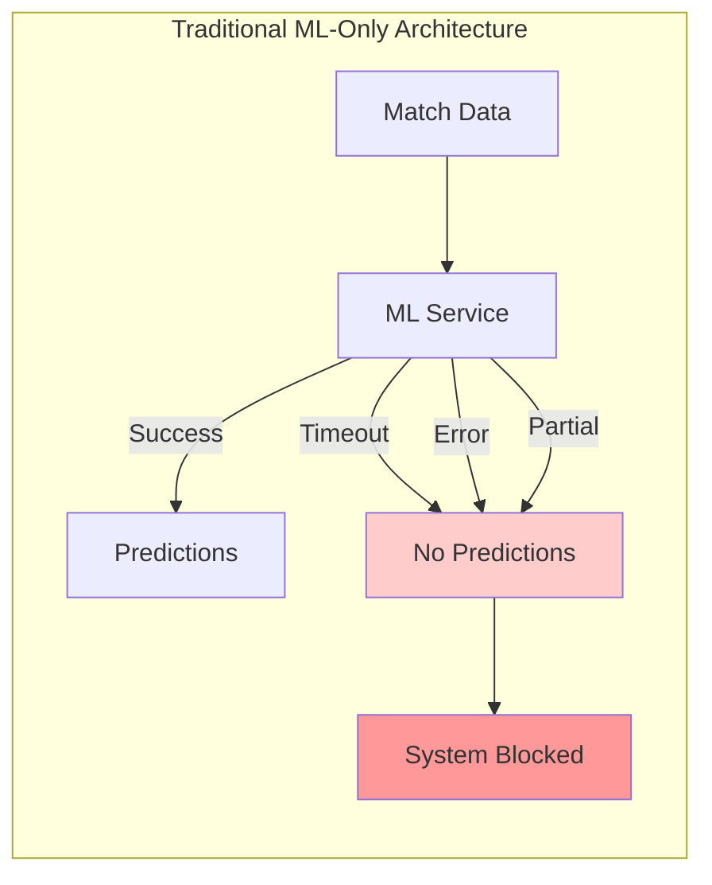
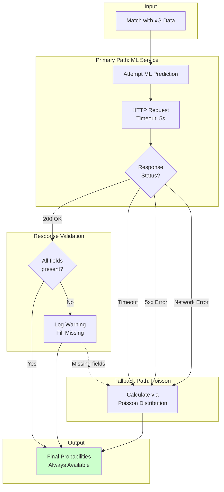
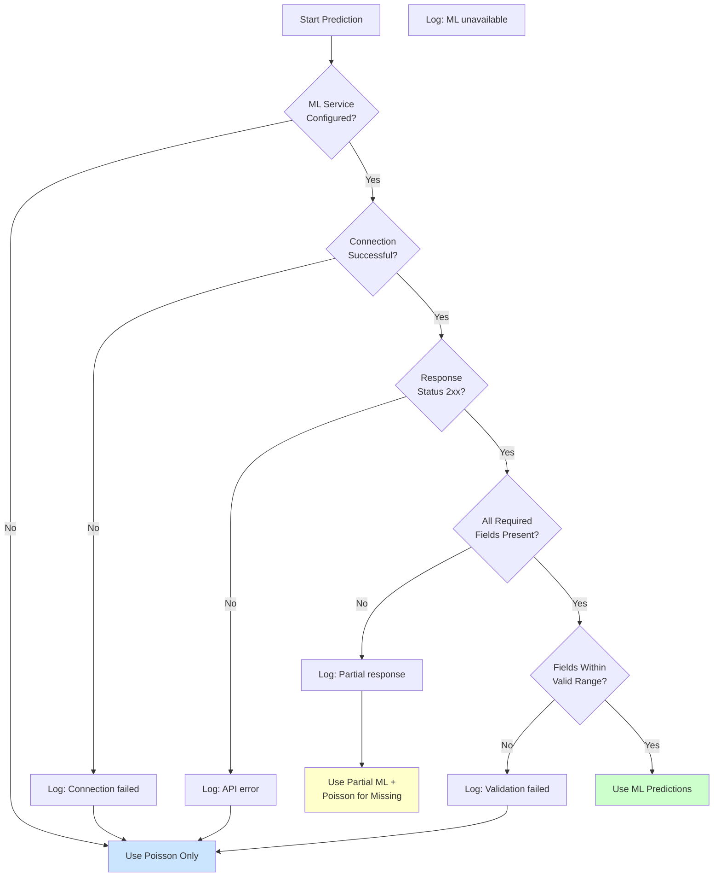
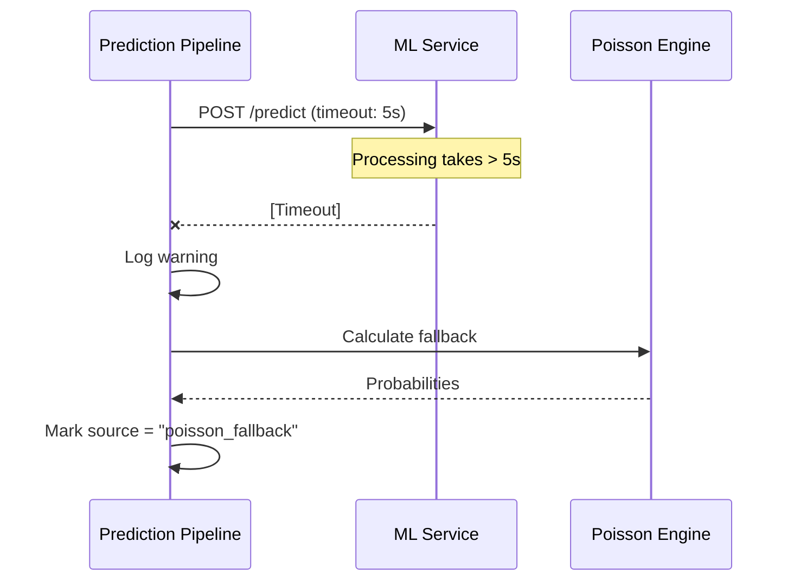
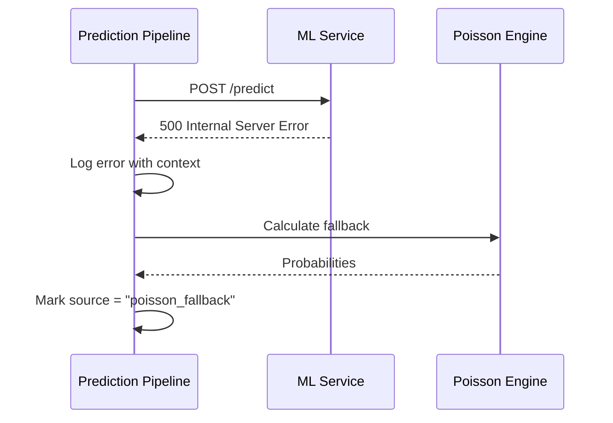
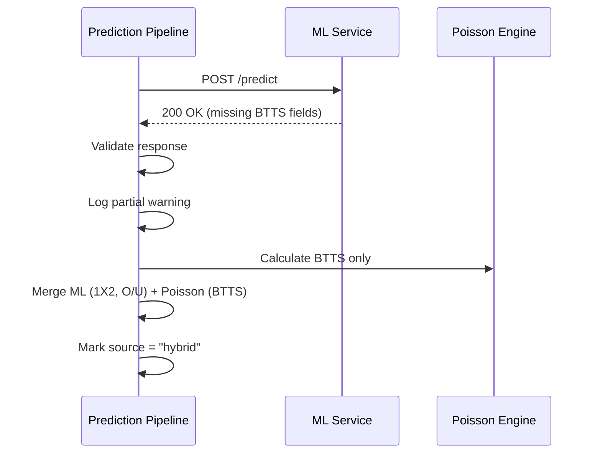
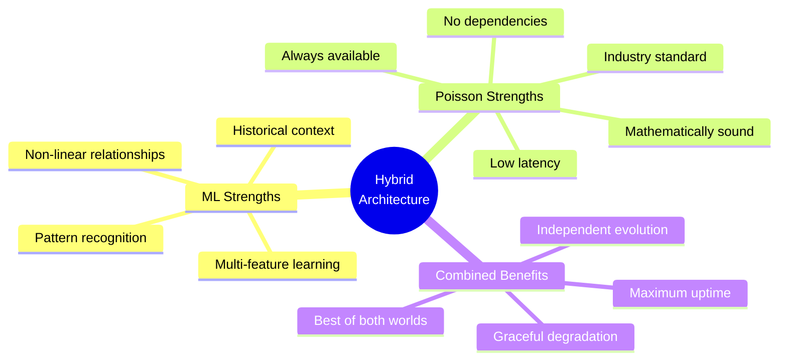

# ML + Poisson Fallback

> Hybrid prediction architecture for maximum resilience

---

## The Problem with Single-Path Dependencies



**Result:** Any ML service issue stops the entire prediction pipeline.

---

## Our Solution: Hybrid Architecture



---

## Decision Tree



---

## Failure Scenarios

### Scenario 1: ML Service Timeout



### Scenario 2: ML Service Returns Error



### Scenario 3: Partial ML Response



---

## Comparison: ML vs Poisson

| Aspect | ML Predictions | Poisson Fallback |
|--------|---------------|------------------|
| **Accuracy** | Higher (when model current) | Industry baseline |
| **Latency** | ~500ms | <10ms |
| **Availability** | Service-dependent | 100% |
| **Features Used** | All available | xG only |
| **Interpretability** | Black box | Fully transparent |
| **Resource Cost** | GPU inference | CPU only |

---

## Why Both Approaches?



---

## Real-World Benefits

### Uptime Comparison

```
Traditional ML-Only:
    ML Up     ████████████████████░░░░ ~85% uptime
    Predictions ████████████████████░░░░ ~85% coverage

Hybrid ML + Poisson:
    ML Up     ████████████████████░░░░ ~85% uptime
    Poisson   ████████████████████████ 100% uptime
    Predictions ████████████████████████ 100% coverage
```

### Quality Distribution

```
When ML is available (85% of time):
    Source: ML predictions
    Quality: Optimal

When ML is unavailable (15% of time):
    Source: Poisson fallback
    Quality: Good baseline (industry standard)

Overall: Never blocked, always producing predictions
```

---

## Implementation Highlights

**Error Handling:**
- Timeouts: Configurable per-endpoint (default 5s)
- Retries: Exponential backoff (1s, 2s, 4s) max 3 attempts
- Circuit breaker: After 5 consecutive failures, skip ML for 60s

**Logging:**
- Every decision logged with match ID
- Fallback reasons tracked for metrics
- Response times recorded for monitoring

**Validation:**
- Probability ranges: 0.0 to 1.0
- Mass check: P(home) + P(draw) + P(away) ≈ 1.0
- xG sanity: 0.0 to 10.0 (reject outliers)

---

[Back to Visualizations Index](./README.md)
