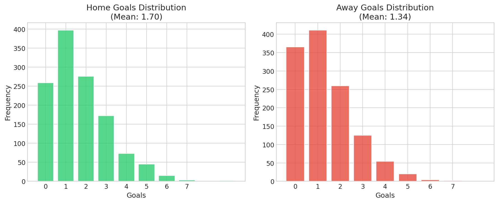
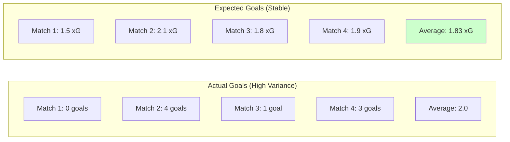
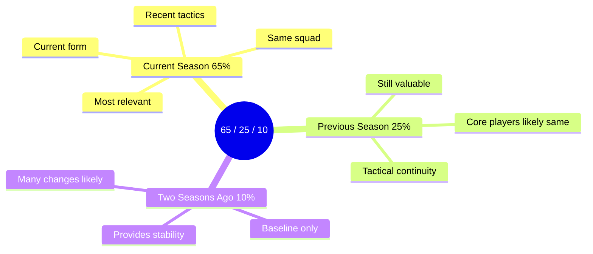
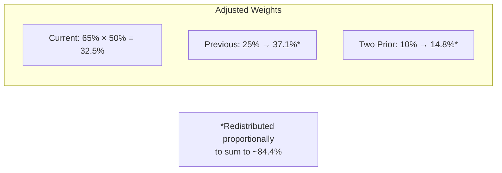
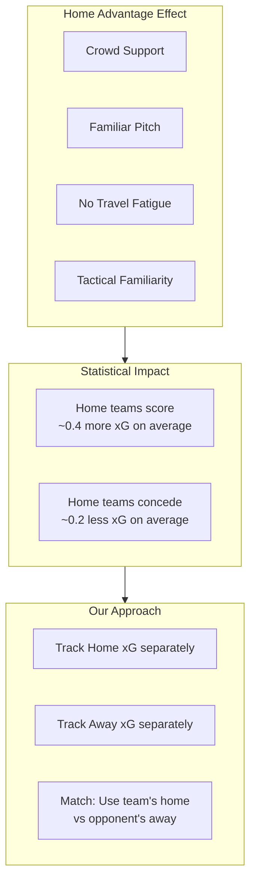
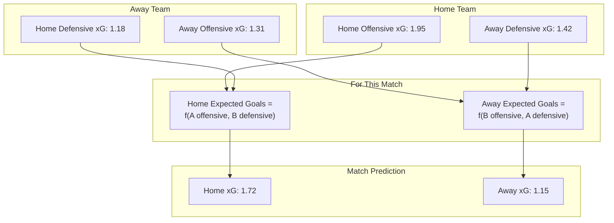

# xG Weighted Calculation

> How historical Expected Goals are combined into match predictions

---

## Goals Distribution in Real Data

<p align="center">
  
</p>

*Home teams score more on average (1.70 vs 1.34). These distributions follow the Poisson pattern we use for predictions.*

---

## What is xG (Expected Goals)?

Expected Goals measures the quality of goal-scoring opportunities. Unlike actual goals (which have high variance), xG captures the underlying performance.



**xG is a better predictor** because it smooths out the luck factor.

---

## Temporal Weighting

We don't use simple averages. Recent data matters more than old data.

### Weight Distribution

```
Season Weights:

Current Season   ████████████████████████████████████  65%
Previous Season  ██████████████░░░░░░░░░░░░░░░░░░░░░░  25%
Two Prior        ██████░░░░░░░░░░░░░░░░░░░░░░░░░░░░░░  10%

```

### Why These Weights?



---

## Season Completion Adjustment

The current season's weight adjusts based on how much of the season has been played.

### Formula

```
Effective Weight = Base Weight × Season Completion %

Example at mid-season (50% complete):
  Current Season: 65% × 0.50 = 32.5% effective
  Previous Season: 25% (unchanged)
  Two Seasons Ago: 10% (unchanged)
  Remaining weight redistributed proportionally
```

### Visual: Weight Progression Through Season

```
Start of Season (0% complete):
Current   ░░░░░░░░░░░░░░░░░░░░  0% (no data yet)
Previous  ██████████████████████████████████  71%
Two Prior ██████████░░░░░░░░░░  29%

Mid-Season (50% complete):
Current   █████████████████░░░  48%
Previous  ███████████████░░░░░  37%
Two Prior ██████░░░░░░░░░░░░░░  15%

End of Season (100% complete):
Current   ████████████████████████████████████  65%
Previous  ██████████████░░░░░░░░░░░░░░░░░░░░░░  25%
Two Prior ██████░░░░░░░░░░░░░░░░░░░░░░░░░░░░░░  10%
```

---

## Calculation Example

### Team: Manchester Example FC

**Raw xG Data:**

| Season | Home xG (avg) | Away xG (avg) | Matches |
|--------|--------------|---------------|---------|
| Current (50% done) | 2.1 | 1.4 | 19 |
| Previous | 1.9 | 1.3 | 38 |
| Two Prior | 1.7 | 1.2 | 38 |

### Step 1: Apply Season Completion



Normalization factor: 32.5 + 37.1 + 14.8 = 84.4% → scale to 100%
- Current: 32.5 / 84.4 = 38.5%
- Previous: 37.1 / 84.4 = 44.0%
- Two Prior: 14.8 / 84.4 = 17.5%

### Step 2: Calculate Weighted Average

```
Home xG Calculation:

Current (2.1):   ████████████████████  × 38.5% = 0.81
Previous (1.9):  ██████████████████████████  × 44.0% = 0.84
Two Prior (1.7): ████████████  × 17.5% = 0.30
                 ─────────────────────────────────
                 Total: 1.95 xG
```

### Step 3: Result

| Venue | Weighted xG |
|-------|-------------|
| Home | 1.95 |
| Away | 1.31 |

---

## Home vs Away Split

Why do we track home and away separately?



---

## Match Prediction Flow



---

## Why This Approach Works

| Benefit | Explanation |
|---------|-------------|
| **Recency bias** | Current form weighted 65% at full season |
| **Early season stability** | Historical data fills gaps when current data sparse |
| **Home/away awareness** | Captures venue-specific performance |
| **Smooth transitions** | Gradual weight shifts prevent sudden changes |
| **Noise reduction** | xG more stable than actual goals |

---

## Key Parameters

| Parameter | Value | Rationale |
|-----------|-------|-----------|
| Current weight | 65% | Strong recency preference |
| Previous weight | 25% | Meaningful historical context |
| Two prior weight | 10% | Baseline stability |
| Min matches for full weight | ~30 | Statistical significance |
| Completion factor | 0-100% | Scales current season contribution |

---

[Back to Visualizations Index](./README.md)
