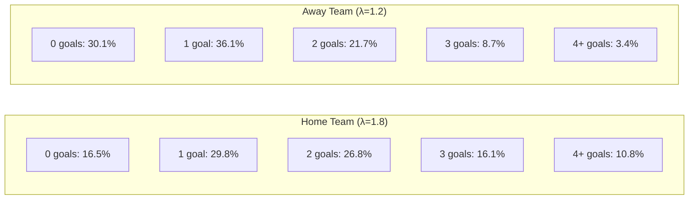
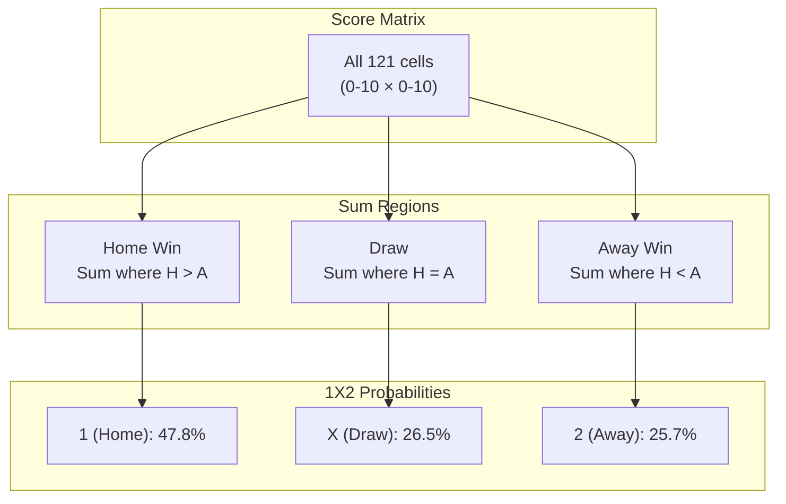
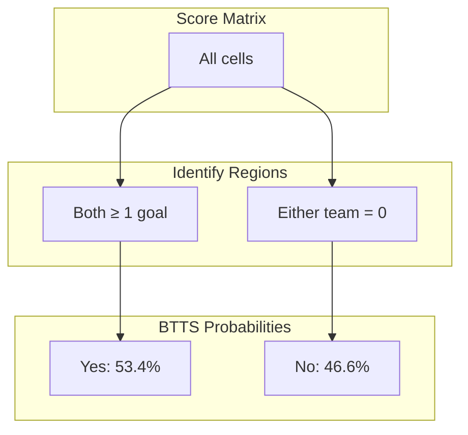
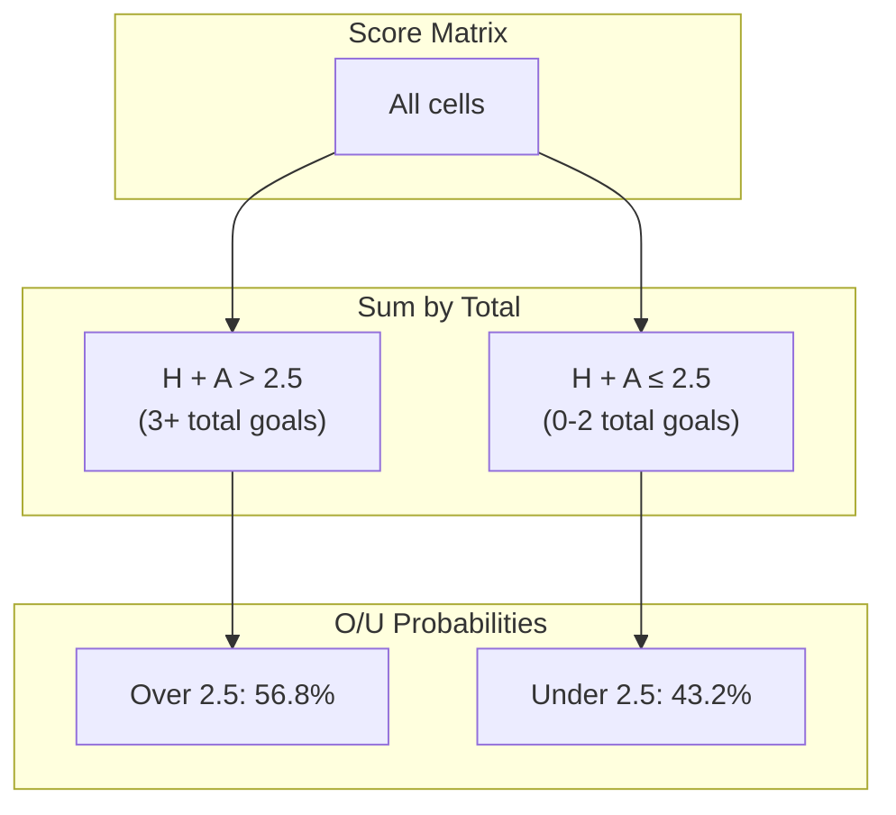
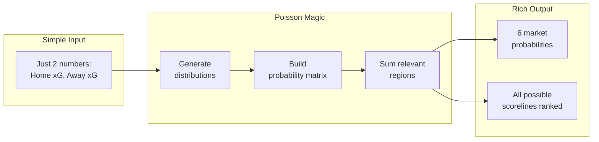

# Poisson Score Matrix

> From xG values to match probabilities

---

## The Poisson Distribution

The Poisson distribution models the probability of a given number of events (goals) occurring in a fixed interval, given an expected rate (xG).

### Formula

```
P(k goals) = (λ^k × e^(-λ)) / k!

Where:
  λ = Expected Goals (xG)
  k = Actual goals (0, 1, 2, 3, ...)
  e = Euler's number (~2.718)
```

### Visual: Poisson Distribution Shape

```
λ = 1.5 (typical xG)

P(goals)
│
0.35┤     █
    │    ███
0.25┤   █████
    │  ███████
0.15┤ █████████
    │███████████
0.05┤█████████████
    └──┬──┬──┬──┬──┬──┬──┬──
       0  1  2  3  4  5  6  7  goals

Distribution: 22% | 33% | 25% | 13% | 5% | 1% | 0.3% | ...
```

---

## Building the Score Matrix

### Step 1: Calculate Each Team's Goal Probabilities

Given:
- **Home Team xG: 1.8**
- **Away Team xG: 1.2**



### Step 2: Build the Joint Probability Matrix

Multiply independent probabilities:

```
                         AWAY GOALS
              0       1       2       3       4+
         ┌────────────────────────────────────────┐
       0 │  5.0%   6.0%   3.6%   1.4%   0.6%  │
       1 │  9.0%  10.8%   6.5%   2.6%   1.0%  │
HOME   2 │  8.1%   9.7%   5.8%   2.3%   0.9%  │
GOALS  3 │  4.8%   5.8%   3.5%   1.4%   0.5%  │
       4+│  3.3%   3.9%   2.4%   0.9%   0.4%  │
         └────────────────────────────────────────┘

Cell value = P(home=row) × P(away=col)
Example: P(1-1) = 29.8% × 36.1% = 10.8%
```

### Step 3: Color-Coded Matrix

```
                         AWAY GOALS
              0       1       2       3       4+
         ┌────────────────────────────────────────┐
       0 │  ░░░     ▓▓▓     ▓▓▓     ███     ███  │  Away wins
       1 │  ░░░     ▒▒▒     ▓▓▓     ███     ███  │
HOME   2 │  ░░░     ░░░     ▒▒▒     ▓▓▓     ███  │
GOALS  3 │  ░░░     ░░░     ░░░     ▒▒▒     ▓▓▓  │
       4+│  ░░░     ░░░     ░░░     ░░░     ▒▒▒  │  Home wins
         └────────────────────────────────────────┘

Legend:  ░░░ Home Win   ▒▒▒ Draw   ▓▓▓/███ Away Win
```

---

## Extracting Market Probabilities

### 1X2 Market (Match Result)



**Visual Selection:**

```
HOME WIN cells (H > A):              DRAW cells (H = A):
    0   1   2   3   4                    0   1   2   3   4
  ┌───────────────────┐                ┌───────────────────┐
0 │                   │              0 │ █                 │
1 │ █                 │              1 │     █             │
2 │ █   █             │              2 │         █         │
3 │ █   █   █         │              3 │             █     │
4 │ █   █   █   █     │              4 │                 █ │
  └───────────────────┘                └───────────────────┘
   Sum: 47.8%                           Sum: 26.5%
```

### BTTS Market (Both Teams to Score)



**Visual Selection:**

```
BTTS YES (both ≥ 1):                 BTTS NO (0 anywhere):
    0   1   2   3   4                    0   1   2   3   4
  ┌───────────────────┐                ┌───────────────────┐
0 │                   │              0 │ █   █   █   █   █ │
1 │     █   █   █   █ │              1 │ █                 │
2 │     █   █   █   █ │              2 │ █                 │
3 │     █   █   █   █ │              3 │ █                 │
4 │     █   █   █   █ │              4 │ █                 │
  └───────────────────┘                └───────────────────┘
   Sum: 53.4%                           Sum: 46.6%
```

### Over/Under 2.5 Goals



**Visual Selection:**

```
OVER 2.5 (total ≥ 3):                UNDER 2.5 (total ≤ 2):
    0   1   2   3   4                    0   1   2   3   4
  ┌───────────────────┐                ┌───────────────────┐
0 │             █   █ │              0 │ █   █   █         │
1 │         █   █   █ │              1 │ █   █             │
2 │     █   █   █   █ │              2 │ █                 │
3 │ █   █   █   █   █ │              3 │                   │
4 │ █   █   █   █   █ │              4 │                   │
  └───────────────────┘                └───────────────────┘
   Sum: 56.8%                           Sum: 43.2%
```

---

## Complete Example

### Input

| Team | xG |
|------|-----|
| Home | 1.8 |
| Away | 1.2 |

### Individual Goal Probabilities (0-5 goals)

| Goals | Home | Away |
|-------|------|------|
| 0 | 16.5% | 30.1% |
| 1 | 29.8% | 36.1% |
| 2 | 26.8% | 21.7% |
| 3 | 16.1% | 8.7% |
| 4 | 7.2% | 2.6% |
| 5 | 2.6% | 0.6% |

### Score Matrix (Most Likely Outcomes)

| Score | Probability | Cumulative |
|-------|-------------|------------|
| 1-1 | 10.8% | 10.8% |
| 1-0 | 9.0% | 19.8% |
| 2-1 | 9.7% | 29.5% |
| 2-0 | 8.1% | 37.6% |
| 0-1 | 6.0% | 43.6% |
| 2-2 | 5.8% | 49.4% |
| 3-1 | 5.8% | 55.2% |
| 0-0 | 5.0% | 60.2% |

### Final Market Probabilities

| Market | Outcome | Probability |
|--------|---------|-------------|
| **1X2** | Home (1) | 47.8% |
| | Draw (X) | 26.5% |
| | Away (2) | 25.7% |
| **BTTS** | Yes | 53.4% |
| | No | 46.6% |
| **O/U 2.5** | Over | 56.8% |
| | Under | 43.2% |

---

## Key Insight: Why This Works



The Poisson model transforms **2 input values** into **complete probability distributions** for all markets.

---

## Limitations

| Limitation | Description | Mitigation |
|------------|-------------|------------|
| Independence assumption | Assumes teams' goals are independent | Dixon-Coles correction (not implemented) |
| Fixed λ | Same expected goals regardless of game state | ML model captures dynamics |
| No tactical adjustment | Doesn't model formations, playing styles | External features via ML |

---

[Back to Visualizations Index](./README.md)
