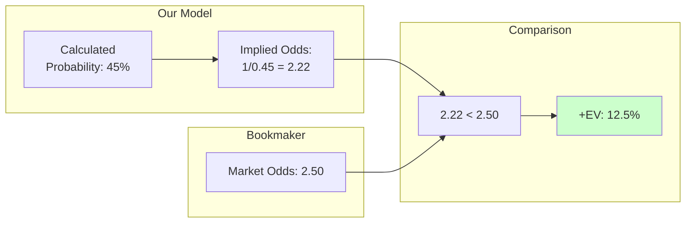
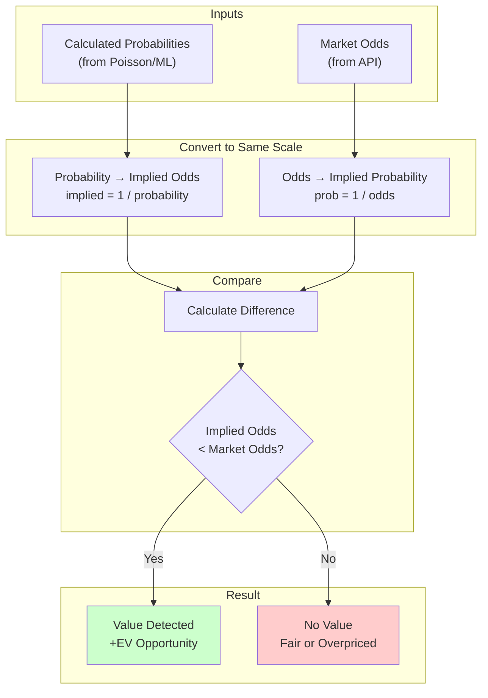
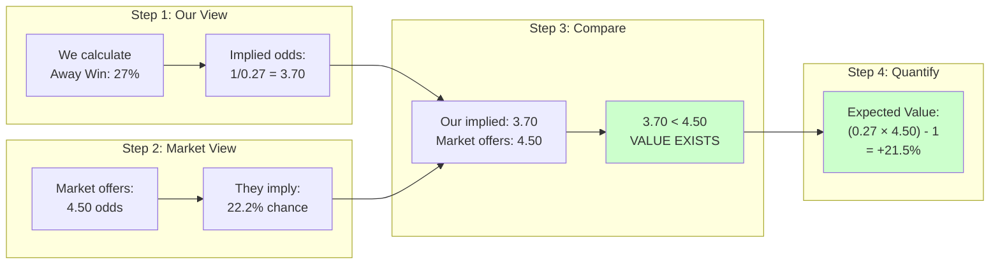
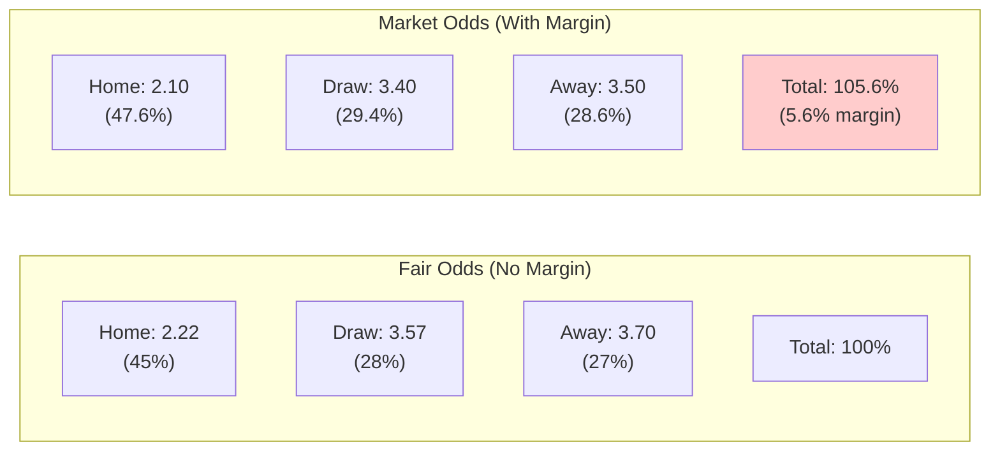
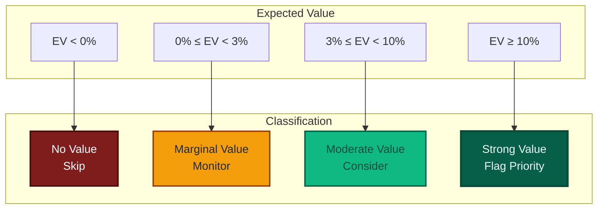
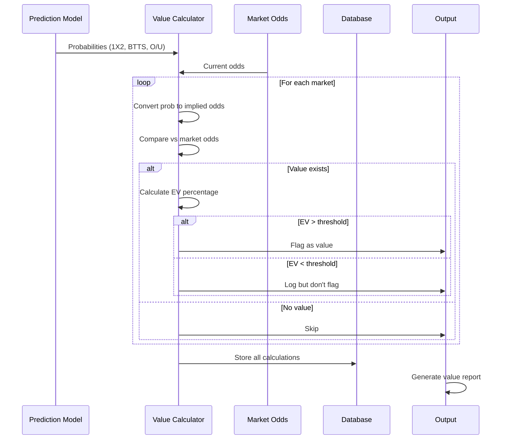

# Value Detection

> Identifying profitable discrepancies between calculated probabilities and market odds

---

## The Core Concept

**Value exists when the market offers better odds than the true probability suggests.**



---

## Value Detection Flow



---

## Step-by-Step Example

### Match: Team A vs Team B

**Our Probabilities (from model):**

| Outcome | Probability | Implied Odds |
|---------|-------------|--------------|
| Home Win | 45% | 2.22 |
| Draw | 28% | 3.57 |
| Away Win | 27% | 3.70 |

**Market Odds (from bookmaker):**

| Outcome | Market Odds | Implied Prob |
|---------|-------------|--------------|
| Home Win | 2.10 | 47.6% |
| Draw | 3.40 | 29.4% |
| Away Win | 4.50 | 22.2% |

### Comparison Matrix

```
                Our      Market    Market     Value
Outcome         Prob     Odds      Implied    Assessment
─────────────────────────────────────────────────────────
Home Win        45%      2.10      47.6%      ❌ NO VALUE
                                              (Market thinks
                                               it's 47.6%, we
                                               think it's 45%)

Draw            28%      3.40      29.4%      ❌ NO VALUE
                                              (Market thinks
                                               it's 29.4%, we
                                               think it's 28%)

Away Win        27%      4.50      22.2%      ✅ VALUE!
                                              (Market thinks
                                               it's 22.2%, we
                                               think it's 27%)
```

### Value Calculation for Away Win



---

## Expected Value Formula

```
EV = (Probability × Odds) - 1

Where:
  EV > 0  → Positive expected value (profitable long-term)
  EV = 0  → Break-even
  EV < 0  → Negative expected value (losing long-term)
```

### Visual: EV by Probability vs Odds

```
                    Market Odds
                 2.0   2.5   3.0   3.5   4.0   4.5   5.0
             ┌──────────────────────────────────────────┐
         60% │ +20%  +50%  +80%  +110% +140% +170% +200%│ Strong value
             │                                          │
Our      50% │  0%   +25%  +50%  +75%  +100% +125% +150%│
Prob         │                                          │
         40% │ -20%   0%   +20%  +40%  +60%  +80%  +100%│
             │                                          │
         30% │ -40%  -25%  -10%  +5%   +20%  +35%  +50% │ Marginal value
             │                                          │
         20% │ -60%  -50%  -40%  -30%  -20%  -10%   0%  │ No value
             └──────────────────────────────────────────┘

Legend:  +XX% = Positive EV (value)
          0%  = Break-even
        -XX% = Negative EV (avoid)
```

---

## Bookmaker Margin

Bookmakers build in a margin (overround) to ensure profit.

### Example: Fair vs Adjusted Odds



**What the margin means:**
- Bookmaker collects 5.6% more in implied probability than 100%
- On average, bettors lose 5.6% of their stakes
- Value betting finds opportunities where our edge exceeds the margin

---

## Value Thresholds

Not all value is worth acting on. We apply thresholds.



---

## Complete Detection Pipeline



---

## Output Example

### Match Report

```
┌─────────────────────────────────────────────────────────────┐
│  Manchester City vs Liverpool                                │
│  Premier League - Matchday 20                               │
├─────────────────────────────────────────────────────────────┤
│  Market     │ Outcome │ Our Prob │ Market │ EV    │ Flag    │
├─────────────┼─────────┼──────────┼────────┼───────┼─────────┤
│  1X2        │ Home    │ 55%      │ 1.80   │ -1%   │ -       │
│             │ Draw    │ 22%      │ 3.80   │ -16%  │ -       │
│             │ Away    │ 23%      │ 4.00   │ -8%   │ -       │
├─────────────┼─────────┼──────────┼────────┼───────┼─────────┤
│  BTTS       │ Yes     │ 62%      │ 1.75   │ +9%   │ ✓ VALUE │
│             │ No      │ 38%      │ 2.00   │ -24%  │ -       │
├─────────────┼─────────┼──────────┼────────┼───────┼─────────┤
│  O/U 2.5    │ Over    │ 68%      │ 1.60   │ +9%   │ ✓ VALUE │
│             │ Under   │ 32%      │ 2.30   │ -26%  │ -       │
└─────────────────────────────────────────────────────────────┘

Value Flags: BTTS Yes (+9%), Over 2.5 (+9%)
```

---

## Why Value Detection Matters

```mermaid
mindmap
  root((Value<br/>Detection)):::core
    Edge Identification:::edge
      Find mispriced markets:::leaf
      Systematic approach:::leaf
      Data-driven decisions:::leaf
    Risk Management:::risk
      Only act on positive EV:::leaf
      Threshold filtering:::leaf
      Avoid marginal bets:::leaf
    Long-term Profitability:::profit
      Law of large numbers:::leaf
      Compound edge over time:::leaf
      Discipline over luck:::leaf
    Market Efficiency:::market
      Exploit slow market updates:::leaf
      React to new information:::leaf
      Beat closing line:::leaf

  classDef core fill:#0f172a,color:#e5e7eb,stroke:#020617,stroke-width:3px
  classDef edge fill:#065f46,color:#ecfdf5,stroke:#064e3b,stroke-width:2px
  classDef risk fill:#92400e,color:#fffbeb,stroke:#78350f,stroke-width:2px
  classDef profit fill:#1e3a8a,color:#eff6ff,stroke:#1e40af,stroke-width:2px
  classDef market fill:#312e81,color:#eef2ff,stroke:#1e1b4b,stroke-width:2px
  classDef leaf fill:#f8fafc,color:#1f2937,stroke:#cbd5e1

```

---

## Key Metrics

| Metric | Description | Target |
|--------|-------------|--------|
| **Hit Rate** | % of value bets that win | 40-60% typical |
| **Average EV** | Mean expected value of flagged bets | >5% |
| **Closing Line Value** | Our odds vs closing odds | Positive CLV |
| **ROI** | Return on investment | >0% (profitable) |
| **Yield** | Profit per unit staked | >3% strong |

---

[Back to Visualizations Index](./README.md)
