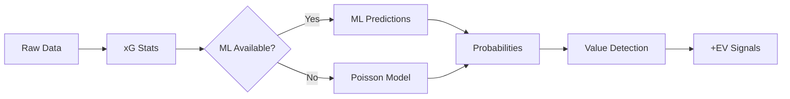

# Visualizations

> Visual guide to the Football Probability Prediction System architecture and data flows

---

## Index

| Visualization | Description | Best For |
|---------------|-------------|----------|
| [System Architecture](./01-system-architecture.md) | High-level component overview | Understanding the big picture |
| [Data Flow Pipeline](./02-data-flow-pipeline.md) | End-to-end data transformation | Following data through the system |
| [ML + Poisson Fallback](./03-ml-poisson-fallback.md) | Hybrid prediction decision tree | Understanding resilience patterns |
| [xG Weighted Calculation](./04-xg-weighted-calculation.md) | Temporal weighting visualization | Statistics methodology |
| [Poisson Score Matrix](./05-poisson-score-matrix.md) | Probability calculation example | Mathematical intuition |
| [Value Detection](./06-value-detection.md) | Market comparison process | Business logic |

---

## Quick Reference

### System Flow (Simplified)

---

## How to Use These Visualizations

**For Recruiters/PMs**: Start with [System Architecture](./01-system-architecture.md) for the big picture, then [ML + Poisson Fallback](./03-ml-poisson-fallback.md) to understand the resilience patterns.

**For Data Scientists**: Focus on [xG Weighted Calculation](./04-xg-weighted-calculation.md) and [Poisson Score Matrix](./05-poisson-score-matrix.md) for the statistical methodology.

**For Engineers**: [Data Flow Pipeline](./02-data-flow-pipeline.md) shows the complete data transformation sequence.

**For Business Stakeholders**: [Value Detection](./06-value-detection.md) explains how the system identifies opportunities.

---

*All diagrams use Mermaid syntax and render natively on GitHub.*
